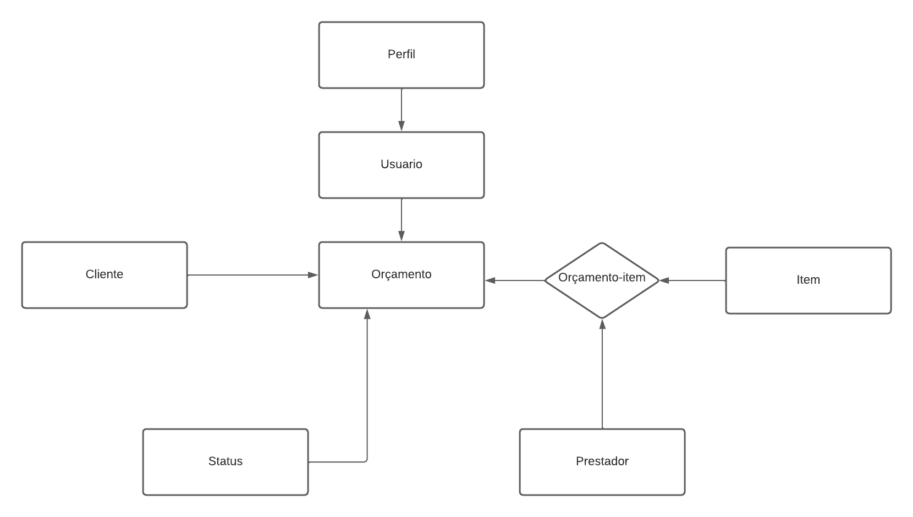

<h1 align="center">API Gestão Service</h1>

<p align="center">API de estudo criada para um sistema de orçamentos, em JavaScript com Node.js</p>

<h4 align="center"> 
	🚧 MVP Pronto 🚧
</h4>

Tabela de conteúdos
=================
<!--ts-->
   * [Tabela de Conteúdo](#tabela-de-conteudo)
   * [Sobre](#Sobre)
   * [Como usar](#como-usar)
      * [Pre Requisitos](#pre-requisitos)
      * [Como Instalar](#como-instalar)
   * [Tecnologias](#tecnologias)
<!--te-->

## 💻 [Sobre](#Sobre)

Esta é uma API de estudos criada em acompanhamento ao curso do [Weberson Rodrigues](https://github.com/WebersonRodrigues), nesta aplicação foi utilizado conceitos:

Arquitetura MVC,
Segurança de codigo,
Divisão de responsabilidades,
Boas praticas de programação,
Escalabilidade,
Documentação com JavaDOC,
DTOS,
Seeds

Estrutura da API

<h1 align="left">
    
</h1>


Esta API será parte de um estudo pessoal, onde pretendo incluir novas funcionalidades, testes e fazer o deploy e disponibilização na AWS.


## [Como usar](#como-usar)

### Pré-requisitos

Antes de começar, você vai precisar ter instalado em sua máquina as seguintes ferramentas:
[Git](https://git-scm.com), [Node.js](https://nodejs.org/en/), [Postgresql](https://www.postgresql.org/), 
Além disto é bom ter um editor para trabalhar com o código como [VSCode](https://code.visualstudio.com/)

### 🎲 Rodando o Back End (API)

```bash

# Clone este repositório
$ git clone https://github.com/Emersonwlw/API-Sistema-Orcamentos.git

# Acesse a pasta do projeto no terminal/cmd
$ cd API-Sistema-Orcamentos

# Instale as dependências
$ npm install

#execute o comando para criar o banco já com dados de teste
$ npm run iniciar-banco-com-dados

# Execute a aplicação
$ npm start

# o Server vai inicar em  <http://localhost:3000>


```

### 🛠 [Tecnologias](#tecnologias)

As seguintes ferramentas foram usadas na construção do projeto:

- [Node.js](https://nodejs.org/en/)
- [Sequelize](https://sequelize.org/)


## Autores

Feito por Emerson Willian 👋🏽


## 📝 Licença

Este projeto esta sobe a licença [MIT]
